<p align="center">
  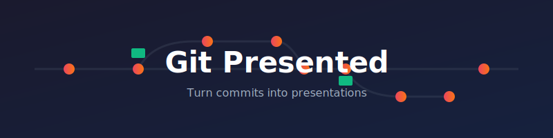
</p>

<p align="center">
  <strong>Stop taking screenshots of code.</strong><br>
  Turn your Git commits into presentation slides automatically.
</p>

<p align="center">
  <a href="#quick-start">Quick Start</a> •
  <a href="#creating-slides">Creating Slides</a> •
  <a href="#themes">Themes</a> •
  <a href="#sharing-presentations">Sharing</a>
</p>

---

Creating presentations with code is painful. You copy snippets, format them, take screenshots, and the moment your code changes everything is outdated. Git Presented eliminates this entirely—your presentation *is* your code history.

```
git commit -m "Add user authentication #presentation"
```

Tag commits with `#presentation` and get a navigable slide deck with syntax-highlighted diffs, automatic code extraction, and zero manual formatting.

## Use Cases

- **Architectural proposals**: Walk stakeholders through code changes step-by-step
- **Personal cheatsheets**: Quick reference for patterns you use repeatedly
- **Codebase documentation**: Remind yourself (or others) about tricky areas
- **Code reviews**: Present complex PRs with context
- **Tutorials**: Build guides from actual, tested commits
- **Conference talks**: Present live code that's always current

## The Workflow

Instead of maintaining slides separately from code:

1. Write your code changes
2. Add comments to highlight important lines
3. Commit with `#presentation` and your slide text
4. Build → Done

Your presentation stays in sync with your code forever.

## Multiple Presentations

Create as many presentations as you need in the same repository—just use separate branches:

```bash
git checkout -b presentation/auth-flow
# Create commits with #presentation
git checkout main  # Back to regular work
```

Each branch with `#presentation` commits becomes its own presentation. The generated site shows all presentations in an overview.

### How Presentations Are Detected

A presentation includes all commits from the **most recent `#presentation` tag** to the **branch tip**. This means:

- You can branch off from any point and start a fresh presentation
- If a branch already has presentation commits, adding a new `#presentation` commit starts a new presentation from that point
- Commits before the last `#presentation` tag are not included

This design lets you fork existing presentations or create new ones from branches that already contain presentation history.

**Keeping presentations current:** When your code evolves, merge updates into your presentation branch:

```bash
git checkout presentation/auth-flow
git merge main
./vendor/bin/jigsaw build
```

Your slides now reflect the latest code. No manual updates needed.

This makes Git Presented ideal for maintaining a personal library of cheatsheets and documentation alongside your regular development work.

## Quick Start

```bash
git clone https://github.com/your-username/git-presented.git
cd git-presented
composer install
cp .env.example .env
```

Edit `.env`:
```env
GIT_REPO_PATH=/path/to/your/repo
```

Build and serve:
```bash
./vendor/bin/jigsaw build
cd build_local && ./present.sh
# Open http://localhost:8000
```

## Creating Slides

### Basic Slide

Any commit with `#presentation` becomes a slide:

```
Initial project setup #presentation

Setting up the base structure for our application.
```

The commit message title becomes the slide title. The body becomes the content. The diff is shown automatically.

### Multiple Slides per Commit

Use `## Heading` to split into sub-slides:

```
Implement user login #presentation

Overview of the authentication flow.

## Database Schema

First, we define the users table...

## Controller Logic

The login controller handles validation...
```

### Highlighting Specific Code

Reference exact lines in your headings:

```
Add validation rules #presentation

## The Request Class [app/Http/Requests/LoginRequest.php:12-25]

These validation rules ensure email and password are required.

## What Changed [app/Http/Requests/LoginRequest.php:12-25:diff]

Here's the diff for this section.
```

Syntax: `[filepath:startLine-endLine]` or `[filepath:startLine-endLine:diff]`

## Keyboard Shortcuts

| Key | Action |
|-----|--------|
| `←` `→` | Previous/next step |
| `↑` `↓` | Previous/next sub-slide |
| `Space` | Next sub-slide |
| `F` | Fullscreen |
| `Escape` | Back to overview |
| `Ctrl+K` | Cycle themes |
| `Ctrl+L` | Toggle browser/beamer mode |

## Themes

11 built-in themes to match your style or presentation context:

<table>
<tr>
<td align="center"><strong>Light</strong><br>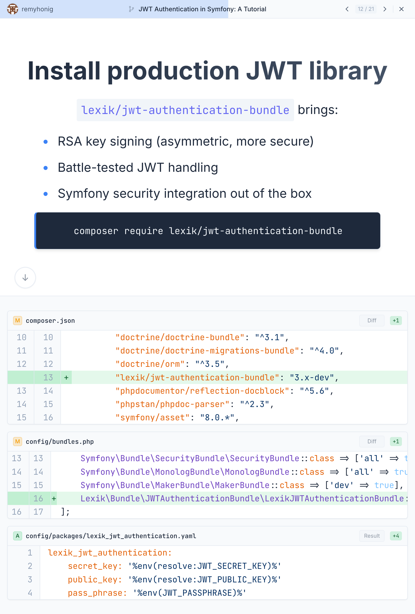</td>
<td align="center"><strong>Dark</strong><br>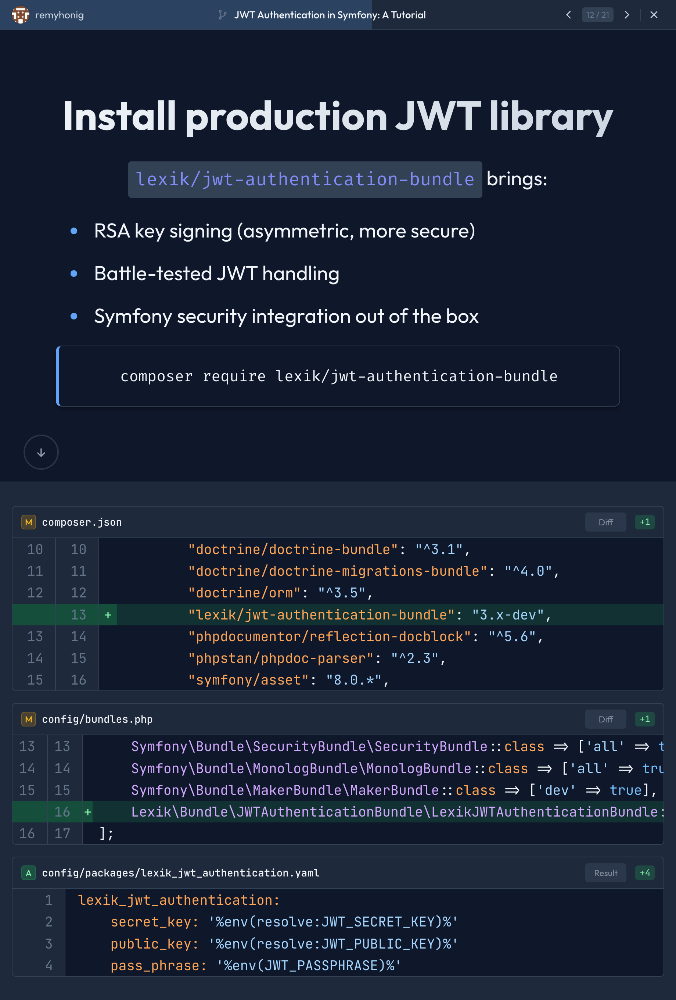</td>
<td align="center"><strong>Presentation</strong><br></td>
</tr>
<tr>
<td align="center"><strong>Laravel</strong><br>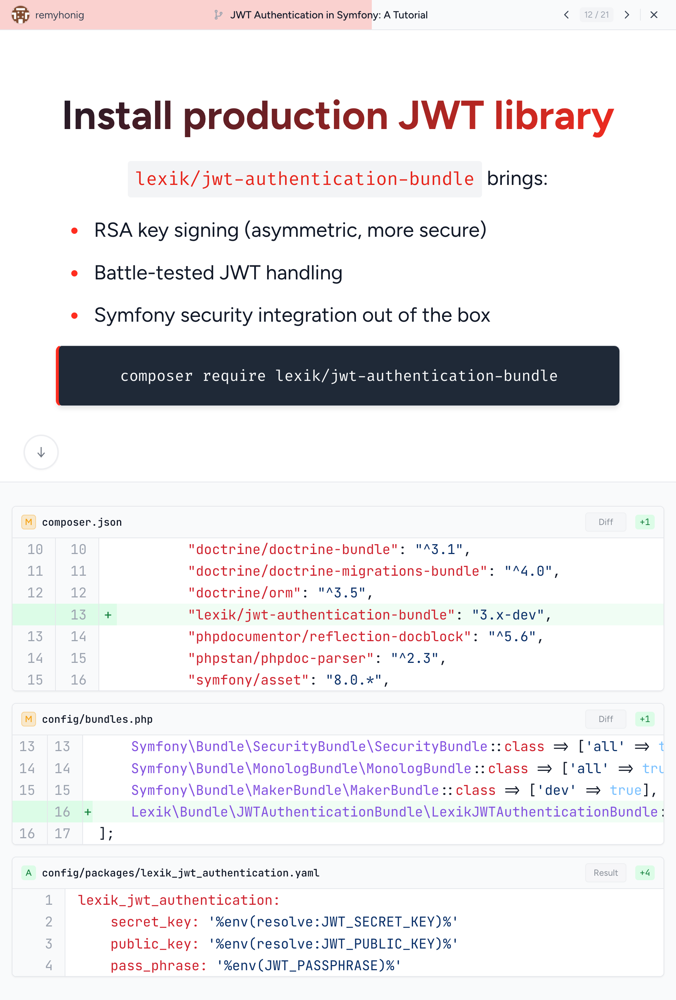</td>
<td align="center"><strong>Symfony</strong><br>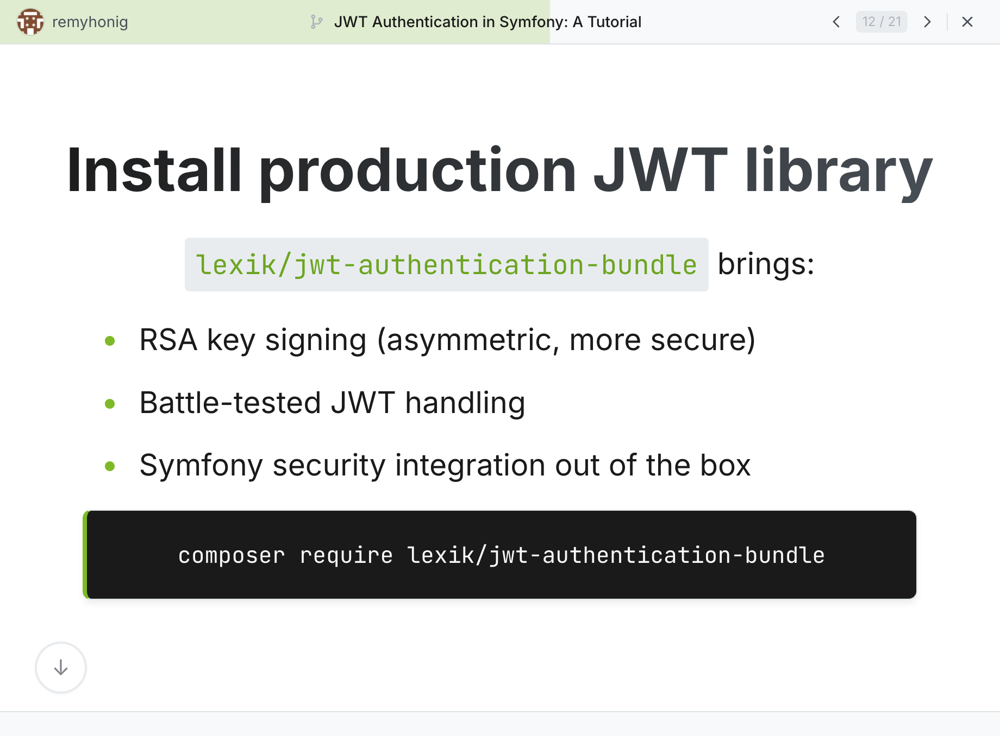</td>
<td align="center"><strong>Microsoft</strong><br>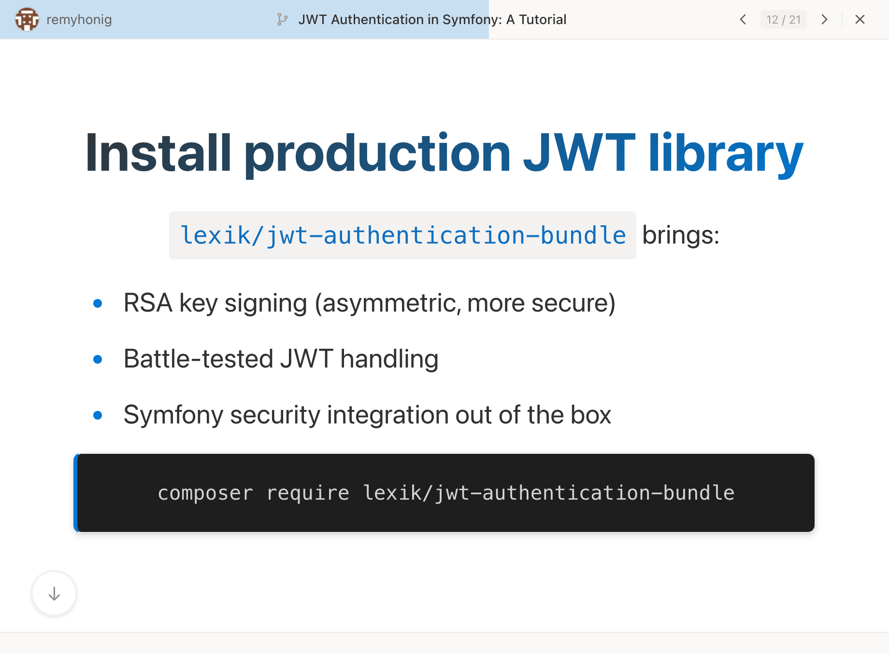</td>
</tr>
<tr>
<td align="center"><strong>Schiphol</strong><br>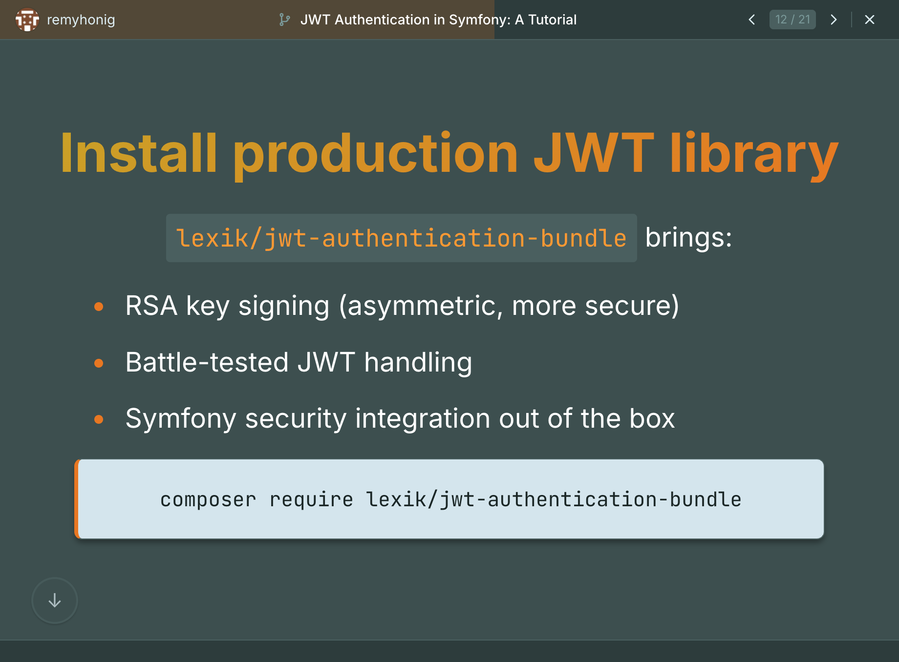</td>
<td align="center"><strong>Catppuccin Latte</strong><br>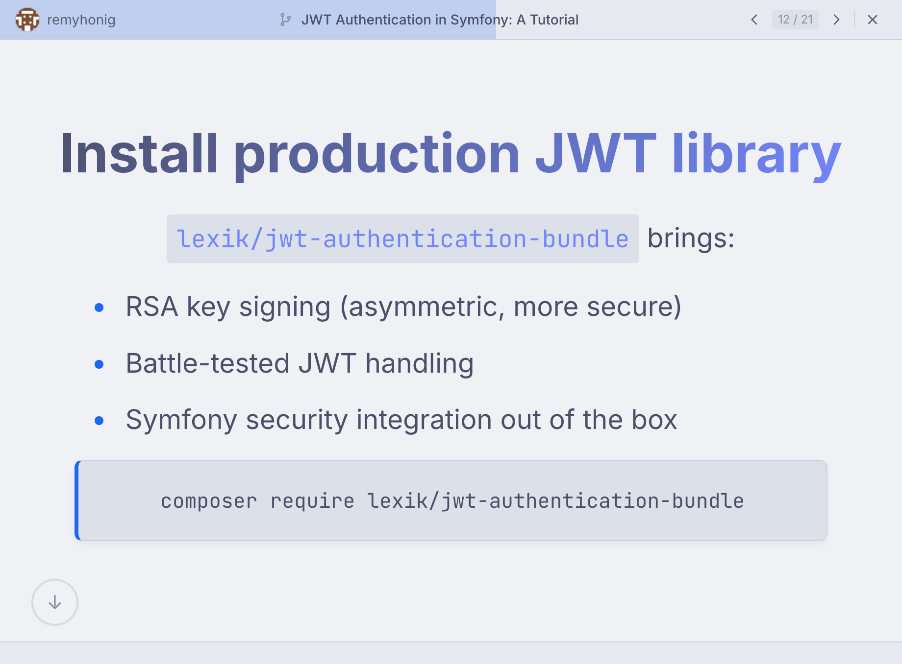</td>
<td align="center"><strong>Catppuccin Frappé</strong><br>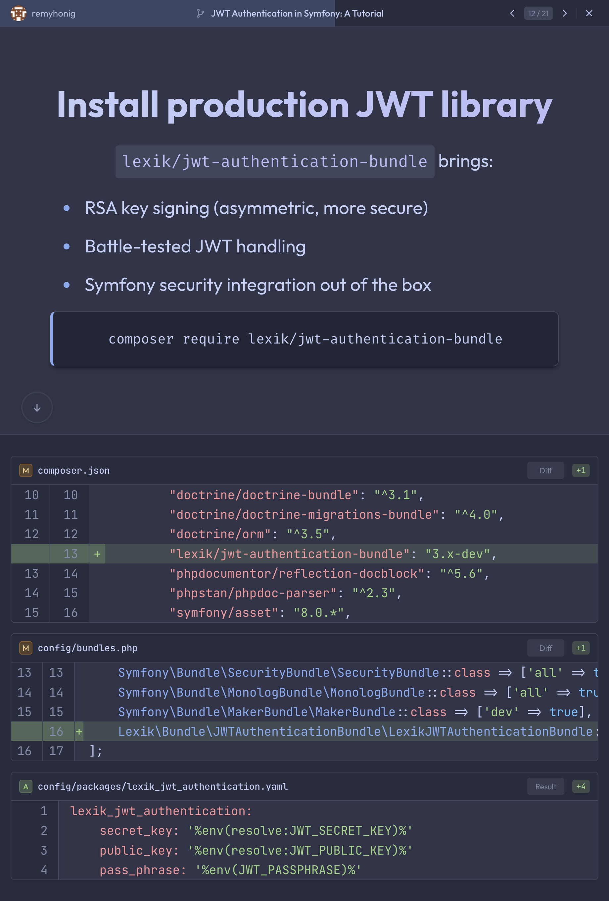</td>
</tr>
<tr>
<td align="center"><strong>Catppuccin Macchiato</strong><br>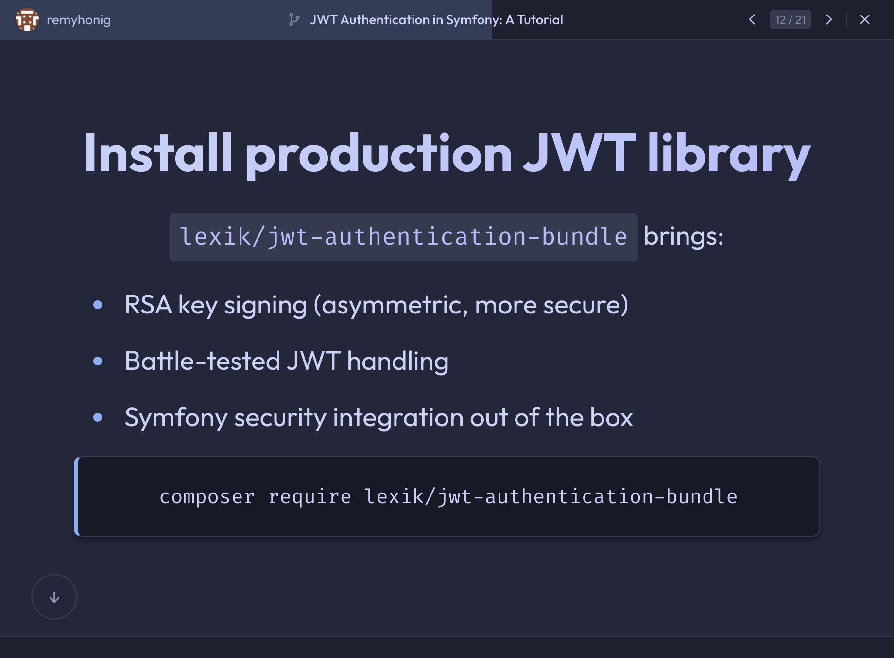</td>
<td align="center"><strong>Catppuccin Mocha</strong><br>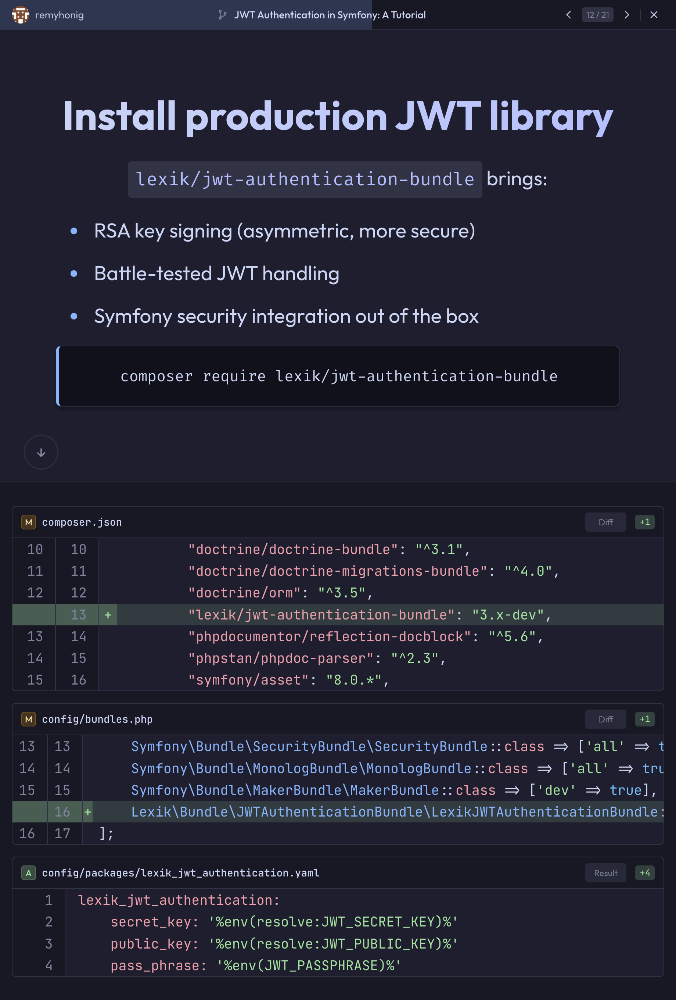</td>
<td></td>
</tr>
</table>

## Configuration

| Option | Description | Default |
|--------|-------------|---------|
| `GIT_REPO_PATH` | Repository to present | `.` |
| `SITE_NAME` | Presentation title | Git Presentations |
| `SITE_AUTHOR` | Author name | (empty) |
| `DEFAULT_THEME` | Starting theme | `light` |
| `DEFAULT_MODE` | `browser` or `beamer` | `browser` |

## Sharing Presentations

Build and zip for distribution:

```bash
./vendor/bin/jigsaw build
zip -r presentation.zip build_local/
```

Recipients unzip and run:
```bash
./present.sh
# Opens at http://localhost:8000
```

Only requires PHP (pre-installed on macOS).

Or deploy the static files to any web host (GitHub Pages, Netlify, Vercel, etc.).

## Development

### Watch Mode

Auto-rebuild on changes (requires `fswatch`):

```bash
brew install fswatch  # macOS
./watch.sh
```

### Adding Themes

Create `source/css/themes/mytheme.css`:

```css
[data-theme="mytheme"] {
    --bg-primary: #ffffff;
    --text-primary: #1a1a1a;
    --accent-primary: #3b82f6;
}
```

Register in `source/_layouts/main.blade.php` and `source/js/main.js`.

## Requirements

- PHP 8.2+
- Composer
- Git

## Contributing

PRs welcome. Please open an issue first for major changes.

## License

MIT
